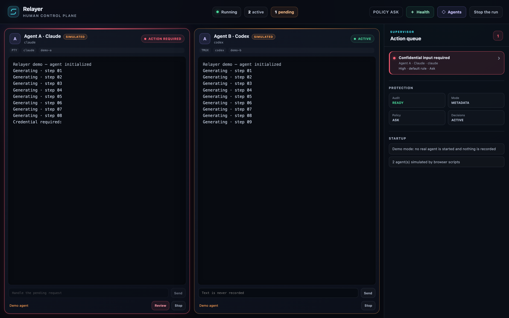
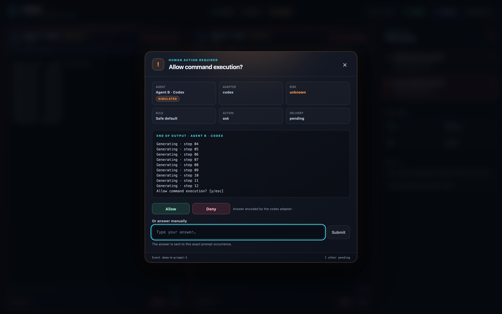

# Relayer

**Run several AI coding agents at once, and answer their prompts from one place.**

[](https://go.dev/)
[](LICENSE)
[](https://github.com/Hocsman/Relayer/actions/workflows/build.yml)
[](https://github.com/Hocsman/Relayer/releases)


Leave an agent unattended and it waits on a question you never see. Watch it and
you do nothing else. Run four and you are switching terminals to find whichever
one stopped.

Relayer runs one to eight interactive CLI agents side by side, watches their
output for confirmation, permission and credential prompts, and holds each agent
there until a human answers. Every decision is recorded in a local audit log
that has no field for your terminal output.

**No API key, no per-token billing, no proxy.** Relayer drives the CLI tools you
already have, with your existing subscriptions and local models. It does not
provide, proxy, or alter access to any AI service: the tools you launch keep
their own authentication, billing, usage limits, terms, and network behavior.

Try it in one command — no configuration, no credentials, two synthetic agents:

```bash
go run github.com/Hocsman/Relayer/cmd/relayer@latest
```

> [!NOTE]
> **Relayer v0.4.0 is General Availability (GA)**. It provides production-ready
> supervision, enterprise telemetry, system alerts, visual configuration, and
> granular per-agent process lifecycle management.
> Prompt detection is heuristic: it assists human operators rather than replacing
> security boundaries. Always review proposed actions and maintain independent
> backups. See the [security model](docs/security-model.md).

## What works today

- One to eight agents, with up to four visible per page.
- Granular per-agent process lifecycle: stop, start, or restart individual agents
  in-place without restarting the supervisor session or affecting siblings.
- Exact argument-vector commands, or explicitly requested shell commands
  (`/bin/sh -c` on Unix, `cmd.exe /c` on Windows).
- PTY, tmux, automatic tmux-to-PTY selection, and mixed concrete backends.
- Native Windows Pseudo Console (ConPTY) support for full native Windows execution.
- Visual configuration editor in Desktop GUI with hot-reload (Policies, Guardrails, Webhooks) without agent restart.
- Interactive terminal text search (`Ctrl+F`) with circular navigation and highlighting via `@xterm/addon-search`.
- Operator arbitration shortcuts: `Alt+1..8` (agent focus/modal), `Ctrl+Enter` (Allow), `Esc` (Deny).
- Fullscreen TUI metrics overlay (`m` / `M`) reporting uptime, decision ratios, and reaction latency stats.
- Enterprise telemetry: built-in Prometheus exporter (`:9090/metrics`), OTLP batch exporter, and Grafana Docker Compose stack.
- Multi-channel notifications: native OS desktop alerts (Windows Toast, macOS Notification Center, Linux notify-send) and remote webhooks (Slack, Discord, generic JSON).
- A bounded terminal-output view and bounded streaming prompt detection.
- Deliberate single-line operator input in the TUI and GUI, separate from
  semantic prompt decisions and guarded by an atomic no-pending-event check.
- A shared, read-only `doctor` preflight for the CLI and GUI that reports the
  effective tools, adapters, backends, policies, platform, and audit readiness
  without starting an agent or creating a missing configuration. When tmux is
  the effective backend it also proves tmux can run a session, inside its own
  private socket.
- A stable, product-neutral `generic` regex adapter.
- Experimental, fixture-backed Claude Code and Codex CLI adapters with the
  stable generic detector retained as fallback.
- First-match approval policies with conservative handling of credentials,
  sensitive events, high or unknown risk, and dry runs.
- Optional local JSONL audit records with rotation, restrictive Unix
  permissions, bounded fields, and mandatory redaction.
- Two deterministic Bash mock agents when `agents: []` is configured.
- Desktop GUI (Wails) for macOS, Linux, and Windows; the Bubble Tea TUI
  remains fully available.

Relayer is not a sandbox, a policy enforcement boundary, a terminal emulator,
or a substitute for reviewing an agent's work. See the
[security model](docs/security-model.md) before using it on valuable data.

## Platform status

| Platform | Status | Notes |
| --- | --- | --- |
| Linux | Supported (GA) | PTY backend; tmux backend when tmux is installed. Desktop GUI and CLI packages published. |
| macOS | Supported (GA) | PTY backend; tmux backend when tmux is installed. Universal Desktop GUI and CLI packages published. |
| Windows, native | Supported (GA) | Native ConPTY backend for PTY execution. Desktop GUI and CLI packages published. |
| WSL | Community | PTY and tmux backends functional under WSL Linux distributions. |

## Prerequisites

- Go 1.25.13 or newer to build from source. The patch-level minimum keeps
  release binaries on a standard library version covered by the vulnerability
  gate.
- A UTF-8 interactive terminal.
- Bash for the bundled mock agents and the reproducible demo.
- tmux only when selecting `tmux` or when you want `auto` to choose it.
- The agent CLIs you configure, installed and authenticated independently.

## Install

### Build from source

```bash
git clone https://github.com/Hocsman/Relayer.git
cd Relayer
go build -o relayer ./cmd/relayer
./relayer --version
```

The root entry point remains available for compatibility:

```bash
go build -o relayer main.go
```

Development builds report `relayer dev (commit unknown)` unless build metadata
is injected.

### Read-only doctor

Inspect an existing configuration before starting Relayer:

```bash
./relayer doctor --config config.yaml
```

The command does not create a missing configuration, open the audit journal,
construct a PTY/tmux backend, execute a provider CLI, or start an agent. Its
report uses agent ordinals and fixed tool catalogue labels; commands,
environment values, configured names and IDs, full paths, and raw dependency
errors are omitted.

Checks are passive with one deliberate exception. When tmux is the effective
backend, doctor runs tmux itself: it creates one short-lived session on a
private socket inside a `0700` temporary directory, reads its identity, and
removes that session by name. Finding the tmux binary is not evidence that it
can serve Relayer's machine-readable protocol, and a report that cannot observe
that difference would announce a healthy backend immediately before startup
fails. The probe never reads, attaches to, or modifies your tmux server, and
never calls `kill-server`. An unusable tmux blocks an explicitly requested tmux
backend and makes `auto` fall back to PTY with a distinct warning.

Exit status is `0` when there is no blocker, including when the report contains
warnings, and `1` when startup should remain blocked. The desktop GUI exposes
the same report through **Health** and **Check the installation**. See the
[doctor guide](docs/doctor.md) for the checks and their limits.

### Desktop GUI



The same supervision, in a high-performance desktop window. Each agent keeps its
own pane; the queue on the right is what is waiting for a human, and both agents
here are marked `SIMULATED` because the demo runs scripted mocks rather than real CLIs.



A prompt carries the end of the agent's own output, so the decision is not made
on a one-line summary. **Allow** and **Deny** appear only when the adapter has
verified bytes for them — here the Codex adapter — and they carry the same
weight, because a supervision tool must not make the permissive answer the one
the eye picks. Everything else is answered by typing what the CLI expects.

Pre-compiled, signed standalone desktop bundles are published for Windows (`x64`),
macOS (Universal `x64` + `arm64`), and Linux (`amd64`) on the [Releases page](https://github.com/Hocsman/Relayer/releases).

You can also build the desktop GUI from source using Wails v2.14.0:

```bash
go install github.com/wailsapp/wails/v2/cmd/wails@v2.14.0
cd cmd/relayer-gui
wails doctor
wails dev       # development window
wails build     # local production artifact below build/bin/
```

By default the GUI loads
`os.UserConfigDir()/relayer/config.yaml`; set `RELAYER_CONFIG` to use another
path. Applications opened from Finder or desktop launchers may not inherit the shell
`PATH`, so use absolute executable paths or launch the app with an explicit `PATH`
when required.

The Desktop GUI features:
- **Visual Settings Editor**: Interactive tabs for `🤖 Agents`, `🛡️ Security & Guardrails`, and `🔔 Notifications & Webhooks`. Edit policies, sensitive paths, and webhooks with immediate **hot-reload** without interrupting or restarting running agent processes.
- **Per-Agent Process Controls**: Granular `Stop`, `Restart`, and `Start` controls on each agent terminal card in the workspace to manage individual agents in place without interrupting sibling processes.
- **Terminal Search (`Ctrl+F`)**: Integrated xterm search toolbar with match count, highlighting, circular `Enter` / `Shift+Enter` navigation, and `Esc` dismissal.
- **Arbitration Shortcuts**: `Alt+1..8` to focus agents / open pending arbitration modals, `Ctrl+Enter` to approve (`Allow`), and `Esc` to deny (`Deny`).
- **Live Observability Dashboard**: Circular SVG gauges for decision ratios, operator reaction latency histograms, guardrail block counts, and live exporter status.

See the [desktop GUI guide](docs/gui.md) for prerequisites, configuration,
shortcuts, and settings reference.

### Releases

Release archives, checksums, signatures and SBOMs are published on the
[Releases page](https://github.com/Hocsman/Relayer/releases) for authorized tags
only. Do not treat an unreviewed third-party binary as an official Relayer
release; verify the signature as shown below.

Select a published `OS` (`linux` or `darwin`) and `ARCH` (`amd64` or `arm64`),
then download and verify the matching archive:

```bash
VERSION=0.4.0
OS=linux
ARCH=amd64
ARCHIVE="relayer_${VERSION}_${OS}_${ARCH}.tar.gz"
BASE_URL="https://github.com/Hocsman/Relayer/releases/download/v${VERSION}"

curl -fLO "${BASE_URL}/${ARCHIVE}"
curl -fLO "${BASE_URL}/relayer_${VERSION}_checksums.txt"
grep "  ${ARCHIVE}$" "relayer_${VERSION}_checksums.txt" | sha256sum -c -
tar -xzf "${ARCHIVE}"
"./relayer_${VERSION}_${OS}_${ARCH}/relayer" --version
```

On macOS, replace the verification command with:

```bash
grep "  ${ARCHIVE}$" "relayer_${VERSION}_checksums.txt" | shasum -a 256 -c -
```

Compare the reported version with the authorized tag before placing the binary
on your `PATH`.

A checksum file published beside the binaries only proves the download was not
corrupted in transit; anyone able to write to the release could replace both.
Verify the signature over that checksum file instead:

```bash
curl -fLO "${BASE_URL}/relayer_${VERSION}_checksums.txt.sig"
curl -fLO "${BASE_URL}/relayer_${VERSION}_checksums.txt.pem"

cosign verify-blob \
  --certificate "relayer_${VERSION}_checksums.txt.pem" \
  --signature "relayer_${VERSION}_checksums.txt.sig" \
  --certificate-identity-regexp '^https://github\.com/Hocsman/Relayer/\.github/workflows/release\.yml@refs/tags/' \
  --certificate-oidc-issuer 'https://token.actions.githubusercontent.com' \
  "relayer_${VERSION}_checksums.txt"
```

Signing is keyless: the release workflow's own identity is bound into a
short-lived certificate and recorded in the public transparency log, so there
is no private key to trust or leak. The identity flags are what make the check
meaningful — without them any valid Sigstore signature would pass.

Build provenance is attested separately and can be checked with the GitHub CLI:

```bash
gh attestation verify "${ARCHIVE}" --repo Hocsman/Relayer
```

Each archive also ships an SBOM (`<archive>.sbom.json`) listing what went into
that build.

## Quick start with safe mocks

On first launch, Relayer creates `config.yaml` without overwriting an existing
file. The generated `agents: []` activates two synthetic Bash agents:

```bash
./relayer
```

Each mock prints 20 progress lines, asks `Overwrite file? [Y/n]`, waits for a
human answer, and displays that answer. It does not call Claude, Codex, Ollama,
or another remote service.

Use another configuration path with:

```bash
./relayer --config ./examples/local.yaml
```

The old `--pane1` and `--pane2` flags still override the first two configured
agents, but they are deprecated. Their values are tokenized into an argument
vector; shell operators, variable expansion, globbing, pipes, substitutions,
and redirections are not interpreted.

## Observability with Prometheus & Grafana

Relayer exports enterprise-grade telemetry out of the box. Spin up the bundled Prometheus and Grafana stack in one command:

```bash
docker compose -f docker-compose.telemetry.yml up -d
```

- **Prometheus** runs at `http://localhost:9090` and scrapes Relayer's `:9090/metrics` endpoint.
- **Grafana** is pre-configured at `http://localhost:3000` (anonymous viewer access, or `admin`/`admin`) with the official dashboard visualising active sessions, pending prompts, decision ratios (allow/deny/auto), guardrail violations, and 95th percentile human reaction latencies.
- See the [observability guide](docs/observability.md) for metric schemas and OTLP exporter setup.

## TUI controls

| Key or input | Action |
| --- | --- |
| `Ctrl+Left`, `Ctrl+Right` | Move focus between agents and the supervisor. |
| `Ctrl+PageUp`, `Ctrl+PageDown` | Move between pages of agents. |
| `Up`, `Down`, `PageUp`, `PageDown` | Scroll the focused viewport. |
| `Mouse wheel` | Scroll the viewport under the pointer. |
| `Left click` | Select an agent or the supervisor. |
| `m`, `M` | Toggle fullscreen session metrics & latency overlay. |
| `i` on a focused idle agent | Compose one ordinary line for that agent. |
| `Esc` while composing | Cancel and erase the ordinary line (or close metrics overlay). |
| `Enter` while composing | Send the ordinary line with one carriage return. |
| `Enter` on a pending prompt | Send the supervisor input to that agent. An empty field is refused: the answer must be typed. |
| `F2`, `F3` on a pending prompt | Answer semantically: allow, or deny. The adapter encodes it, and the audit records the decision as made by a human. Adapters that cannot represent the answer leave the prompt pending. |
| `Enter` on an idle tmux agent | Attach the native tmux client. |
| `Ctrl+B`, then `d` | Default tmux detach sequence; custom tmux bindings may differ. |
| `Ctrl+C` | Stop supervision and begin backend shutdown. |

When a prompt is pending, Relayer highlights the pane and focuses the
supervisor. The supervisor title shows how many agents are waiting once more
than one is, so a queue building up behind the agent you are answering — on
another page, possibly — is visible rather than implicit. By default, Relayer
emits an operator alert when a human decision is needed: an ASCII terminal bell
(`\a`) and a native OS desktop notification (configurable under `notifications`
in `config.yaml`). Credential and sensitive inputs are masked in the TUI. Masking does
not prevent the target program from echoing the value into its own terminal or
tmux scrollback.

Ordinary input is application text, not raw terminal passthrough: it must be
valid UTF-8, contain no Unicode control character, and fit within 4096 bytes.
It is refused if that session already has a detected prompt, a decision or
attach is in flight, the session exited, or delivery state is uncertain. A
prompt already emitted by the target but not yet read by Relayer remains a
fundamental observation race; the input action is not a policy approval.

The in-TUI viewport is a bounded text view, not a full VT emulator. Use native
tmux attach for full-screen interactive applications.

## Configuration

Version 1 configuration is strict YAML: unknown fields, aliases, merge keys,
multiple documents, and incorrect scalar types are rejected before any backend
starts. The following example shows every top-level section:

```yaml
version: 1
backend: auto # pty, tmux, or auto

telemetry:
  enabled: true
  service_name: "relayer-local"
  prometheus:
    enabled: true
    address: ":9090"
    path: "/metrics"
  otlp:
    enabled: false
    endpoint: ""
    interval: 15s

notifications:
  enabled: true
  os_notifications: true
  terminal_bell: true
  webhooks:
    - name: slack-ops
      type: slack # slack, discord, generic
      url: https://hooks.slack.com/services/...
      min_severity: warning

sessions:
  persist_on_exit: false
  cleanup_on_success: true

policies:
  profile: developer-friendly # developer-friendly, strict, permissive, custom
  default_action: ask
  dry_run: false
  guardrails:
    block_destructive: true   # Blocks rm -rf, mkfs, format
    block_exfiltration: true  # Blocks curl | bash, reading .ssh / .env
    workspace_only: true      # Restricts agent modifications to workspace
  rules:
    - name: ask-reviewer-confirmations
      match:
        event_types: [confirmation]
        agent_ids: [reviewer]
        risk_levels: [unknown]
        sensitive: false
        text_regex: '(?i)continue'
      action: ask

audit:
  enabled: true
  mode: metadata # off, metadata, or detailed
  path: ""       # empty selects the private per-user default
  max_file_size_mb: 10
  max_files: 5

agents:
  - id: builder
    name: Builder
    command: ["claude"]
    cwd: .
    env:
      RELAYER_ROLE: builder
    adapter: generic
    backend: pty

  - id: reviewer
    name: Local reviewer
    command: ["ollama", "run", "llama3.2"]
    adapter: generic
    backend: tmux

  - id: scripted
    name: Explicit shell example
    shell: 'printf "ready\\n"; exec ./local-agent'
    adapter: generic
    backend: auto

intercept_patterns:
  - pattern: '(?i)overwrite.*\[y/n\]'
    description: overwrite confirmation
  - pattern: '(?im)password:[[:space:]]*$'
    description: credential prompt
  - pattern: '(?i)enter the code we sent you'
    description: second factor challenge
    sensitive: true
```

Important configuration behavior:

- `command` is an exact argument vector and does not invoke a shell. Prefer it.
- `shell` is mutually exclusive with `command` and explicitly invokes
  `/bin/sh -c` on supported Unix systems. Treat shell text as code.
- Relative `cwd` and audit paths are resolved from the configuration file's
  directory. An agent working directory must already exist.
- Agent environment entries override the inherited process environment. Avoid
  putting credentials in YAML: generated configuration files use mode `0644`.
- A blank per-agent backend inherits the global backend. `auto` chooses tmux
  when its executable is found and otherwise falls back to PTY with a visible
  warning. An explicit unavailable `tmux` backend is an error before startup.
- `persist_on_exit` concerns detached tmux sessions during ordinary application
  shutdown. PTY sessions remain owned by the Relayer process. An explicit GUI
  **Stop the run** or restart strictly stops both PTY and owned tmux sessions,
  regardless of this setting. Relayer never kills the tmux server.
- `cleanup_on_success` removes a successful Relayer-owned tmux session even
  when persistence is enabled.
- `agents: []` means the two mocks; otherwise one to eight agents are accepted.

See [configuration](docs/configuration.md) for validation, inheritance,
backends, deprecated flags, policies, and legacy pattern-only files.

## Prompt detection and decisions

The generic adapter strips ANSI sequences, handles fragmented output and
carriage-return rewrites, and tests the active prompt line against ordered
regular expressions. It suppresses common quotation, code-fence, table,
history, and old-log shapes to reduce false positives. Regex interception is
still heuristic: it can miss a prompt or be tricked by output that resembles
one.

Policies use first-match order. Match fields are combined with AND, while
values inside one list use OR. Conservative invariants always win:

- credentials and sensitive events require a human;
- automatic `allow` requires explicit `low` risk; `unknown` or `high` risk
  cannot be auto-allowed;
- a matched `deny` may be automatic for an otherwise valid, non-sensitive
  confirmation, including at `unknown` or `high` risk;
- invalid, incomplete, or non-actionable events ask;
- dry-run mode records the proposal but asks instead of delivering it;
- if an adapter cannot encode an automatic decision, Relayer asks instead.

The current generic adapter encodes manual supervisor input only. Consequently,
an `allow` or `deny` policy evaluated against a generic prompt falls back to a
human ask. `deny` means an adapter-defined refusal, not process termination.

Three adapters are implemented: stable `generic`, plus version-specific
experimental `claude` and `codex`. Claude Code coverage is limited to the
workspace-trust and detected-environment-key prompts observed with 2.1.59;
Codex coverage is limited to directory trust and command approval observed
with `codex-cli 0.148.0-alpha.21`. Every other prompt still uses the configured
`intercept_patterns` fallback. See [adapters](docs/adapters.md) for the exact
decision bytes and non-claims.

## Audit log

Newly generated configuration enables local `metadata` auditing. Configurations
created before the audit block existed and legacy pattern-only configurations
remain disabled for compatibility.

The audit is JSONL and records Relayer lifecycle, event, policy, delivery,
ordinary-input outcome, attach, and cleanup metadata. It never has fields for
raw terminal output, commands, environment values, manual or ordinary input
values, encoded decision bytes, or raw errors. Detailed summaries are bounded
and redacted. Sensitive events use a constant summary and omit derivative
event IDs.

On Unix, the dedicated audit directory and files are checked for restrictive
ownership, type, and permissions. Writes are synchronized line by line, and
files rotate within configured bounds. Audit failure is fail-closed for startup
and further decision delivery, but the audit is not signed and redaction is not
a data-loss-prevention guarantee.

See [audit logging](docs/audit.md) for the schema, default path, retention,
failure behavior, and confidentiality limits.

## Architecture and security

Relayer separates configuration and validation, adapter event processing,
policy evaluation, audit recording, terminal backends, and the TUI. Sessions
communicate through typed events; terminal output, prompt windows, supervisor
logs, and queues are bounded. Startup validates all plans and initializes the
audit before launching an agent, and partial startup is rolled back.

The tmux backend creates one marked session per agent and checks immutable
ownership metadata before cleanup. Runtime launch files and FIFOs are private,
but a process still runs with the current user's authority. Native tmux attach
temporarily leaves the TUI and is outside policy interception until Relayer
resynchronizes after detach.

Read [architecture](docs/architecture.md), the [security model](docs/security-model.md),
and [SECURITY.md](SECURITY.md) before using Relayer with untrusted commands or
sensitive repositories.

## Limits worth knowing

- An agent may act before emitting a detectable prompt.
- An ordinary line can precede a prompt that the target emitted but Relayer has
  not read yet; the no-pending CAS protects only events already detected.
- Prompt-like output can spoof the supervisor; a real prompt can evade regexes.
- Generic and Claude cannot automate allow/deny delivery; Codex automation is
  limited to the exact fixture-backed interactions documented above.
- Terminal rendering is intentionally bounded and not a complete emulator.
- tmux persistence can intentionally leave processes running after Relayer
  exits; inspect them with `tmux list-sessions`.
- Cancellation of an already blocked PTY input write relies on session
  `Stop`/`Close` closing the PTY descriptor; a request context alone cannot yet
  interrupt that in-flight Unix `write`.
- Separate Relayer processes do not coordinate rotation of one shared audit
  path.
- Configuration files and command-line arguments are not secret stores.
- Native Windows agent execution uses ConPTY; the tmux backend remains Unix-only.

See [troubleshooting](docs/troubleshooting.md) for startup, tmux, prompt,
rendering, persistence, and audit diagnostics.

## Development and contribution

```bash
go test -race ./...
go vet ./...
go build ./cmd/relayer
```

Contributions are welcome, especially product-neutral prompt fixtures, backend
lifecycle tests, accessibility improvements, and documentation that narrows
ambiguous security claims. Read [CONTRIBUTING.md](CONTRIBUTING.md) first. Report
security issues using the private process in [SECURITY.md](SECURITY.md), not a
public issue containing secrets.

The reproducible [`docs/demo.tape`](docs/demo.tape) exercises only bundled mocks
and tmux; it does not reference a pre-rendered image or vendor transcript.

## License

Relayer is distributed under the [MIT License](LICENSE).
